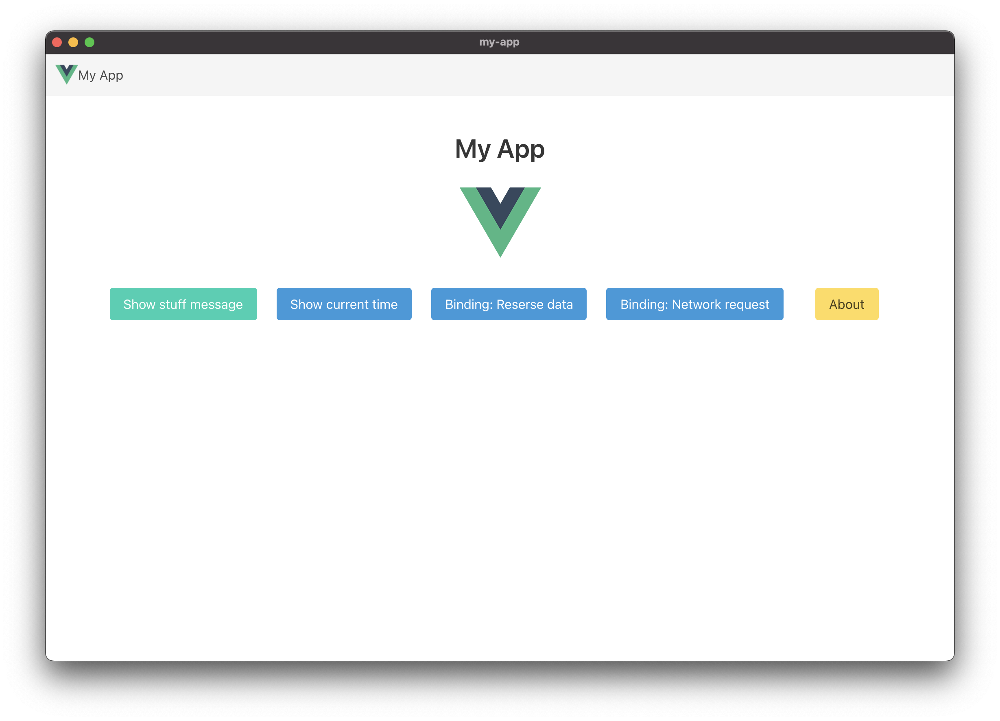

# MikoIDE - Rebuilt from Scratch with Monaco



**MikoIDE** is a completely rebuilt open-source code editor designed to be **faster, lighter, and more stable than VSCode** while keeping a familiar developer experience and API compatibility.

> This is **not a fork of VSCode**. We built the entire core from scratch and only use **Monaco Editor** (the text engine behind VSCode) as a component.

---

## What makes it different from VSCode?

* **C++ Core + CEF** → No more Electron overhead
* **Monaco Editor** integrated for full compatibility with themes and editor features
* **Bun.js + Vite** for the UI → Say goodbye to massive `node_modules`
* **Extension Sandbox** → Each extension runs isolated, reducing memory leaks and CPU spikes
* **Cross-platform** from day one (Windows, macOS, Linux)
---

## Build from scratch

### Requirements

* CMake 3.25+
* Bun.js 1.1+
* Python 3.10+
* VS2022 / Xcode / GCC

### Steps

```bash
# Install UI dependencies
bun install

# Build C++ core with CEF
cmake -S app -B build
cmake --build build --config Release

# Run in dev mode
bun run dev
```

---

## Roadmap

* [ ] VSCode-compatible extension API layer
* [ ] Native debugger core
* [ ] Full extension sandboxing (process isolation + WASM)
* [ ] Remote development support (SSH / Cloud)

---

## License

MIT License

Credits:

* [Monaco Editor](https://github.com/microsoft/monaco-editor)
* [Chromium Embedded Framework (CEF)](https://bitbucket.org/chromiumembedded/cef)
* [Bun.js](https://bun.sh)
* [Cef Simple with Vue.js Template - I adapt to React WebUI](https://github.com/paulocoutinhox/cef-sample)

