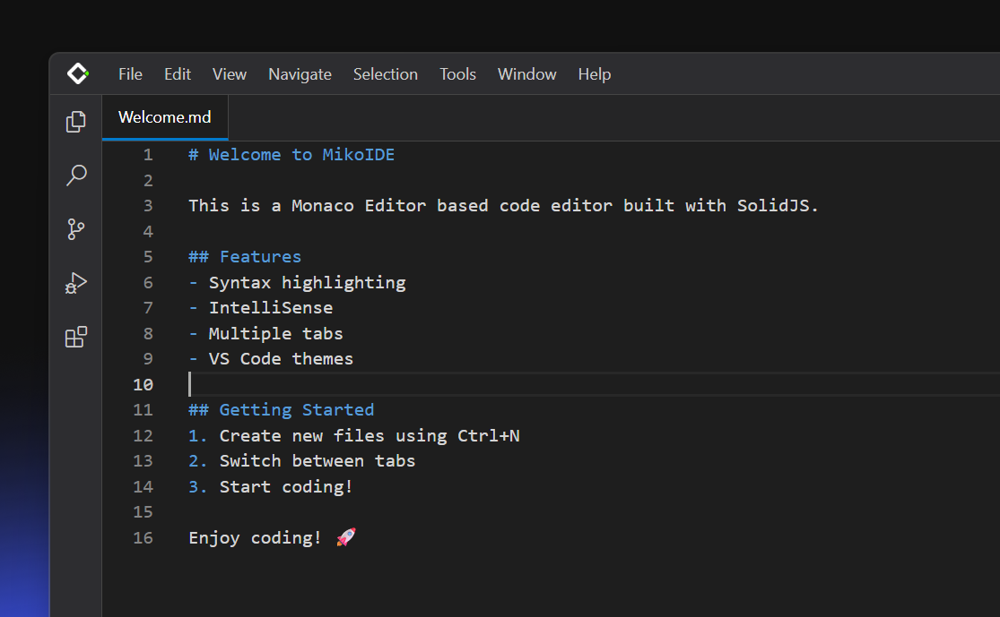

# MikoIDE




A modern, cross-platform IDE built with C++ and TypeScript, featuring integrated Language Server Protocol (LSP) support for C, C++, and TypeScript development.

## Features

- 🚀 **Fast Performance**: Native C++ backend with optimized web-based frontend
- 🔧 **LSP Support**: Built-in language servers for C, C++, and TypeScript
- 🎨 **Modern UI**: Clean, responsive interface built with Solid.js and TypeScript
- 🛠️ **CMake Integration**: Seamless project building and management
- 📦 **Extension System**: Modular architecture for easy extensibility
- 🔍 **Advanced Editor**: Syntax highlighting, code completion, and error detection

## Architecture

```
MikoIDE/
├── app/                    # C++ application core
│   ├── main.cpp           # Application entry point
│   ├── client.cpp         # WebView client implementation
├── mikobench/             # TypeScript frontend (Solid.js + Vite)
│   ├── src/               # Frontend source code
│   └── components/        # Solid.js components
├── extensions/            # LSP extensions
│   └── lsp/
│       ├── c/             # C language server
│       ├── cpp/           # C++ language server
│       └── typescript/    # TypeScript language server
└── tools/                 # Build and utility tools
    ├── build.ts           # CMake build automation
    ├── clean.ts           # Project cleanup utility
    └── utils/             # Conversion utilities
```

## Prerequisites

- **Windows 10/11** with MSVC (Visual Studio 2019 or later)
- **CMake 3.25+**
- **Bun.js** (latest version)
- **Git** with submodule support

## Quick Start

### 1. Clone the Repository

```bash
git clone --recursive https://github.com/mikofure/mikoide.git
cd mikoide
```

### 2. Install Dependencies

```bash
bun install
```

### 3. Build the Project

```bash
# Build frontend
bun run build

# Convert HTML to C++ binary resources
bun run buildtobin

# Build main application
bun run build:cmake main --verbose

# Build LSP extensions
bun run build:cmake c-lsp --verbose
bun run build:cmake cpp-lsp --verbose
```

### 4. Run MikoIDE

```bash
.\build\Release\MikoIDE.exe
```

## Development

### Available Scripts

- `bun run dev` - Start development server for frontend
- `bun run build` - Build production frontend
- `bun run preview` - Preview built frontend
- `bun run build:cmake <project>` - Build specific CMake project
- `bun run clean:cmake <project>` - Clean specific CMake project
- `bun run buildtobin` - Convert HTML to C++ binary
- `bun run iconconvert` - Convert PNG to ICO format

### Project Structure

#### Frontend (mikobench/)
Built with Solid.js, TypeScript, and Vite for fast development and optimal performance.

#### Backend (app/)
C++ application using:
- **Chromium Embedded Framework (CEF)** for rendering the frontend
- **Binary Resource Provider** for embedded web assets
- **Logger** for debugging and diagnostics

#### LSP Extensions (extensions/lsp/)
Language servers providing:
- Syntax highlighting
- Code completion
- Error detection
- Go-to definition
- Symbol search

### Build Tools

Custom TypeScript build tools provide:
- **Automated CMake builds** with proper configuration
- **Project cleanup** with selective artifact removal
- **Resource conversion** from web assets to C++ binaries
- **Cross-platform compatibility** (Windows focus)

## Contributing

1. Fork the repository
2. Create a feature branch (`git checkout -b feature/amazing-feature`)
3. Commit your changes (`git commit -m 'Add amazing feature'`)
4. Push to the branch (`git push origin feature/amazing-feature`)
5. Open a Pull Request

### Development Guidelines

- Use **Bun.js** for all JavaScript/TypeScript operations
- Use **CMake** for all C++ builds (MSVC on Windows)
- Follow existing code style and conventions
- Add tests for new features
- Update documentation as needed

## License

This project is licensed under the MIT License - see the [LICENSE](LICENSE) file for details.

## Acknowledgments

- Built with modern C++ and TypeScript
- Powered by CMake and Bun.js
- LSP integration for enhanced development experience
- Chromium Embedded Framework for seamless web-native integration

## Credits

- [Codicons](https://github.com/microsoft/vscode-codicons) by Microsoft, licensed under [Creative Commons Attribution 4.0 International Public License (CC BY 4.0)](https://creativecommons.org/licenses/by/4.0/legalcode) and [MIT License](https://opensource.org/licenses/MIT).
- Visual Studio Code and its icons are trademarks of Microsoft. This project is not affiliated with or endorsed by Microsoft.

---
**MikoIDE** - Modern IDE for Modern Development 🚀