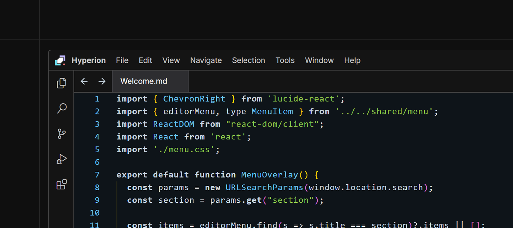

# MikoIDE - Hyperion




A modern, high-performance IDE built with C++ and React/TypeScript, featuring Chromium Embedded Framework (CEF) for seamless web-native integration. The project includes multiple executables: the main Hyperion IDE, terminal utilities (mikoterminal, termibench), and web helper components (mikowebhelper).

## Features

- 🚀 **Native Performance**: C++ backend with CEF-powered React frontend for optimal speed
- 🎨 **Modern UI**: Clean, responsive interface built with React, Redux Toolkit, and Tailwind CSS
- 🖥️ **Custom Window Management**: Borderless window with custom title bar and drag regions
- 📦 **Binary Resource Embedding**: Web assets compiled directly into the executable via miko:// protocol
- 🔍 **Monaco Editor**: Advanced code editing with syntax highlighting and IntelliSense
- 🎯 **Multi-Target Building**: Automated build system for main app and utility tools
- 🖼️ **Off-Screen Rendering**: CEF OSR for seamless integration with native window management
- 🔧 **Terminal Integration**: Built-in terminal utilities (mikoterminal, termibench)
- 🌐 **Web Helper Components**: Dedicated web helper processes for enhanced functionality

## Architecture

```
MikoIDE/
├── app/                                # C++ Native Application
│   ├── main.cpp                        # Application entry point with CEF initialization
│   ├── client/                         # CEF browser client implementation
│   │   ├── client.cpp                  # Main client 
│   │   ├── offscreenrender.cpp         # CEF Offscreen Rendering  
│   │   ├── windowed.cpp                # SDL Window Management   
│   │   ├── mikoclient.cpp              # CEF Client (HyperionClient class)
│   │   └── app.cpp                     # CEF application class
│   ├── resources/                      # Binary resource management
│   │   ├── resources.cpp               # Resource provider for miko:// protocol
│   │   ├── webapp.cpp                  # Embedded web application resources
│   │   ├── editor.cpp                  # Embedded editor resources
│   │   └── menuoverlay.cpp             # Embedded menu overlay resources
│   ├── renderer/                       # Graphics rendering
│   │   ├── linux/                      # Linux-specific renderer
│   │   │   └── vulkan_renderer.cpp     # Vulkan renderer for Linux
│   │   └── dx11_renderer.cpp           # DirectX 11 renderer for CEF integration
│   ├── utils/                          # Utilities and configuration
│   │   ├── logger.cpp                  # Logging system
│   │   └── config.hpp                  # Application configuration
│   ├── internal/                       # Internal communication
│   │   └── simpleipc.cpp               # Inter-process communication
│   ├── bootstrap/                      # Application bootstrap
│   │   └── bootstrap.cpp               # Initialization and setup
│   ├── cli/                            # Command-line utilities
│   │   ├── core/                       # Core utilities and configuration
│   │   └── main.c                      # Command-line entry point
│   ├── terminal/                       # Terminal UI
│   │   ├── processmanager.cpp          # Process management for terminal utilities
│   │   ├── renderer.cpp                # Terminal renderer
│   │   └── terminalbuffer.cpp          # Terminal buffer management
├── mikobench/                          # React/TypeScript Frontend
│   ├── src/                            # WEBUI Source code directory
│   │   ├── rootui/                     # Main application UI
│   │   │   ├── App.tsx                 # Root application component
│   │   │   ├── components/             # UI components (TitleBar, Navbar, Statusbar)
│   │   │   ├── contexts/               # React contexts (WorkbenchContext)
│   │   │   └── mikoide/                # Core IDE components (Workbench, TabBar)
│   │   ├── editor/                      # Code editor implementation
│   │   │   ├── MonacoEditor.tsx        # Monaco editor integration
│   │   │   ├── core/                   # Editor core functionality
│   │   │   └── tabbar/                 # Editor tab management
│   │   ├── components/                 # Reusable UI components
│   │   │   ├── DOMEditor.tsx           # DOM-based editor
│   │   │   ├── DOMTabBar.tsx           # Tab bar component
│   │   │   └── LanguageSwitcher.tsx    # Language selection
│   │   ├── overlays/                   # UI overlays
│   │   │   ├── command/                # Command palette
│   │   │   └── menu/                   # Context menus
│   │   ├── store/                      # State management
│   │   │   ├── index.ts                # Redux store configuration
│   │   │   └── editorSlice.ts          # Editor state slice
│   │   ├── providers/                  # React providers
│   │   │   └── QueryProvider.tsx       # Query provider for data fetching
│   │   └── shared/                     # Shared utilities
│   │       ├── context.ts              # Shared context definitions
│   │       └── menu.ts                 # Menu utilities
│   └── buildweb.ts                     # Custom build script for web assets
└── tools/                              # Build and Development Tools
    ├── build.ts                        # Multi-project CMake build automation
    ├── clean.ts                        # Project cleanup utility
    ├── prod.ts                         # Production build and packaging
    └── utils/                          # Build utilities
        ├── buildtobin.ts               # HTML to C++ binary converter
        └── iconconvert.ts              # Icon format converter
```

## Prerequisites

- **Windows 10/11** with MSVC (Visual Studio 2019 or later)
- **CMake 3.19+** (required for FetchContent and modern CMake features)
- **Bun.js** (latest version for JavaScript/TypeScript tooling)
- **Git** with submodule support

## Quick Start

### 1. Clone the Repository

```bash
git clone --recursive https://github.com/mikofure/hyperion.git
cd mikoide
```

### 2. Install Dependencies

```bash
bun install
```

### 3. Build the Project

#### Option A: Full Build (Recommended)
```bash
# Complete build process
bun run build:win
```

#### Step-by-Step Build
```bash
# 1. Build React frontend
bun run build

# 2. Convert web assets to C++ binary resources
bun run buildtobin

# 3. Build main application
bun run build:cmake
```

### 4. Run MikoIDE

```bash
.\build\Release\Hyperion.exe
```

## Development

### Available Scripts

#### Frontend Development
- `bun run dev` - Start development server for React frontend
- `bun run build` - Build production React frontend
- `bun run preview` - Preview built frontend

#### Backend Development
- `bun run build:cmake` - Build specific CMake project (main, mikoterminal, termibench, mikowebhelper, hyprn)
- `bun run clean:cmake` - Clean specific CMake project

#### Resource Management
- `bun run buildtobin` - Convert HTML/CSS/JS to C++ binary resources
- `bun run iconconvert` - Convert PNG icons to ICO format

#### Production Builds
- `bun run build:win` - Complete development build
- `bun run tools/prod.ts --portable` - Build portable executable
- `makensis shared\windows\installer.nsi` - Build with installer

### Project Structure Details

#### Frontend (mikobench/)
Built with modern React ecosystem:
- **React 18.3** with TypeScript for component architecture
- **Redux Toolkit** for state management
- **Tailwind CSS 4.1** for styling
- **Monaco Editor** for advanced code editing
- **Vite 7.1** for fast development and building
- **Custom build pipeline** that generates single-file HTML for embedding

#### Backend (app/)
Native C++ application featuring:
- **Chromium Embedded Framework (CEF)** for rendering React frontend
- **SDL3** for cross-platform window management and input handling
- **DirectX 11** renderer for optimal graphics performance
- **Off-Screen Rendering (OSR)** for seamless CEF integration
- **Binary Resource Provider** for embedded web assets via `miko://` protocol
- **Custom window management** with borderless design and drag regions
- **Inter-process communication** for component integration
- **Terminal utilities** including mikoterminal and termibench
- **Web helper processes** for enhanced functionality

#### CLI Tools (app/cli/)
Command-line utilities providing:
- **mikoterminal** - Terminal application with advanced features
- **termibench** - Terminal benchmarking and performance testing
- **mikowebhelper** - Web helper process for browser integration
- **hyprn** - CLI tool for system operations and utilities

### Build System

The project uses a sophisticated build system:

#### CMake Configuration
- **FetchContent** for automatic dependency management
- **Multi-platform support** (Windows focus, Linux/macOS compatible)
- **Automatic CEF download** and extraction
- **SDL3 integration** with proper configuration
- **Resource embedding** system for web assets

#### TypeScript Build Tools
Custom build automation providing:
- **Multi-project builds** with dependency management
- **Parallel compilation** for faster builds
- **Verbose logging** for debugging build issues
- **Cross-platform compatibility** checks
- **Resource conversion** pipeline

## Contributing

1. Fork the repository
2. Create a feature branch (`git checkout -b feature/amazing-feature`)
3. Commit your changes (`git commit -m 'Add amazing feature'`)
4. Push to the branch (`git push origin feature/amazing-feature`)
5. Open a Pull Request

### Development Guidelines

- Use **Bun.js** for all JavaScript/TypeScript operations
- Use **CMake** for all C++ builds (MSVC on Windows)
- Follow existing code style and conventions
- Add tests for new features
- Update documentation as needed

## License

This project is licensed under the MIT License - see the [LICENSE](LICENSE) file for details.

## Acknowledgments

- Built with modern C++ and TypeScript
- Powered by CMake and Bun.js
- LSP integration for enhanced development experience
- Chromium Embedded Framework for seamless web-native integration

## Credits
see in [credit.md](credit.md)

---
**MikoIDE** - Modern IDE for Modern Development 🚀